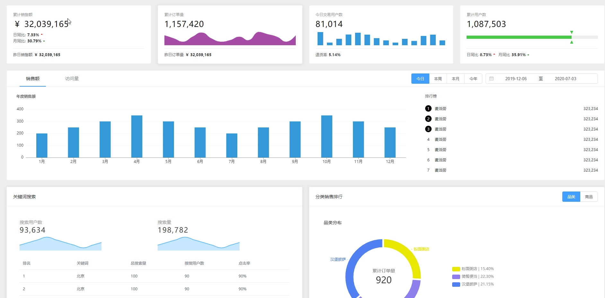

# 数据可视化



canvas绘制的是一个在画布上绘制的图像 svg绘制的是dom对象
WebGL 3D绘图协议，为canvas提供硬件3D加速渲染，可以借助系统显卡来在浏览器里更流畅的展示3D场景和模型，还能创建复杂的导航和数据视觉化。

* zrender 二维绘图引擎，提供canvas、svg、vml等多种渲染方式，是      echarts的渲染器。动态会创建一个 canvas 是对canvs和svg的一次封装。
* D3 拿到数据，通过数据驱动的方式，更新DOM
* tree.js 基于WebGL的js 3D图形库

Highcharts  Echarts  AntV
three.js    zrender  D3
canvas      svg      WebGL

    Chrome

## Echarts

### 组件

``` javascript
        // 标题区
        title: {
          text: '' // 主标题
          subtext: '' //副标题
          left: 'center' //位置
          textStyle: { //主标题样式
            color: 'red',
            fontSize: 28
          }
          subtextStyle: { //副标题的样式

          }
          show: false //控制该组件是否可见
        }
        //绘图区
        grid: {

        }
        // 图例 适用于不同系列的数据过滤（只显示某一系列），搭配series的系列内的name属性，series name属性
        legend: {
          data: [{
            name: name1,
            icon: 'circle'
          }, name2],
          top: 64 //调节位置
        }
        //工具栏
        toolbox: {
          feature { //工具按钮，可以自己设置
            saveAsImage: {}
            dataView: {} //数据表格化,也可更改数据反馈到视图上
            restore: {} // 刷新，将更改重置到初始态
            dataZoom: {} //区域缩放
          }
        }

        xAxis: {
            name: '' // x轴的名字
            data: [] // x轴显示的名字
          },
          yAxis: {
            name: '' //y轴的名字
            splitNumber: //将y轴分为几段
              interval: // 刻度间的间距
              minInterVal: //刻度间的最小间距
              maxInterval:
          },
          series: [ // 多个状图的组合，一个对象代表一个类型（一个系列）的图
            {
              type: 'bar' // 图形的形状
              name: '' // tooltip提示个，该系列的标识
              data: [] // 数据y值
              //data也可以是二维数组 data:[[x,y]]
              markPoint: {
                data: [{
                  type: 'max' //数量最多的有标记点
                }],
                itemStyle: {
                  color: 'blue' //标记点的颜色
                }
              },
              markLine: {
                data: [{
                  type: 'average'
                }]
              }
            }
          ]
```

定位
通过修改grid组件的定位控制图标的位置
采用类似css absolute[top、bottom、left、right]的定位属性来控制组件的位置
相对于容器组件的位置

在grid组件中单个绘图区
x: 距离左边的距离
y: 距离上边的距离
x2：距离右边的距离
y2：距离下边的距离

### 折线图

xAxis：{

    //间隙，与原点，最左边具有间隙--一定的距离
    boundaryGap:false 

}

### 散点图

series:[

    {
        type:'scatter',
        data:[
            [x,y,点的大小]
        ]
        symbolSize:function(param){
            return param[2]
        }
    }

]

### 地图

1. js文件，用script标签引入后会自动注册地图名字和数据。
2. json文件，需要使用ajax异步加载后手动注册，注册方法 echarts.registerMap()。
3. 可以使用series系列中的map生成配置地图，会自动生成自己的geo。
4. 也可以直接使用geo{}组件生成地图，geo还支持在绘制散点图、线集（在series为散点图的中通过coordinateSystem:"geo"与geo组件对应）
5. 还可以在series中通过指定geoIndex与geo对应，

### 多坐标轴

1. 在yAxis中写入两组数据，统一行间距, 使辅助线不错纵复杂
2. 在series中设置数据时，使用yAxisIndex属性设置其与哪个y轴相关
3. 或者使用 splitLIne:false关闭某一y轴的辅助线

``` js
    yAxis: [{
        type: 'value',
        axisLabel: {
          formatter: '{value} kg'
        },
        min: 0, // 'dataMin' 数据最小值
        max: 40, // 'dataMax' 数据最大值
        interval: 10
        //间距为4:1的关系
      },
      {
        type: 'value',
        axisLabel: {
          formatter: '{value} ml'
        },
        min: 0,
        max: 4,
        interval: 1
        //两个的行间距保持一致
      }
    ]
```

### 数据更新

1. 请求到数据后，setOption()
2. 先setOption(),也就是有什么配置什么，请求到数据后，再追加配置

在数据加载的过程中，还可以使用loading
myChart.showLoading()
myChart.hideLoading() //隐藏

### 数据集

将数据写在每个series系列中的方法，有缺点

1. 不适合数据处理
2. 不利于多个系列共享一份数据
3. 不利于基于原始数据进行图表类型、系列的映射安排

dataset的优点

1. 基于数据，设置映射关系，形成图表
2. 数据和配置分离，便于单独管理
3. 数据可以被多个系列或者组件复用
4. 支持更多的数据常用格式，例如二维数组，对象数组

使用维度，encode进行映射 ，(https://echarts.apache.org/examples/zh/editor.html?c=doc-example/dataset-encode-simple0)
Echarts会自动从dataset.source的第一行、列中获取维度信息，但是，如果在dataset.source中指定了
dimensions，那么ECharts不会再自动从source中获取。
encode可以更精确的定义series系列中data的哪个维度被编码，行列映射更加精确

``` js
   dataset: {
     // 数组样式
     //  source: [
     //    ['x轴的名字', '人数', '难度'],
     //    ['html     ', 200, 250],
     //    ['css      ', 100, 150],
     //    ['js       ', 300, 400]
     //  ]
     //对象的形式
     dataset: {
       dimensions: ['product', '2015', '2016', '2017'],
       source: [{
           product: 'Matcha Latte',
           '2015': 43.3,
           '2016': 85.8,
           '2017': 93.7
         },
         {
           product: 'Milk Tea',
           '2015': 83.1,
           '2016': 73.4,
           '2017': 55.1
         },
         {
           product: 'Cheese Cocoa',
           '2015': 86.4,
           '2016': 65.2,
           '2017': 82.5
         },
         {
           product: 'Walnut Brownie',
           '2015': 72.4,
           '2016': 53.9,
           '2017': 39.1
         }
       ]
     },
   }
   series: [{
       type: 'bar'
     },
     {
       type: 'bar'
     }
   ]

   dataset: {
       dimensions: [
         'Income',
         'Life Expectancy',
         'Population',
         'Country',
         {
           name: 'Year',
           type: 'ordinal'
         }
       ],
       source: [
         //  //当以列为维度时，第一行写与不写都可以
         //  ["Income", "Life Expectancy", "Population", "Country", "Year"],
         [815, 34.05, 351014, "Australia", 1800],
         [1314, 39, 645526, "Canada", 1800],
         [985, 32, 321675013, "China", 1800],
       ]
     },
     series: [{
       type: 'scatter',
       symbolSize: symbolSize,
       xAxisIndex: 0,
       yAxisIndex: 0,
       //在这一系列中，只使用
       encode: {
         x: 'Income', //直接使用index，默认是从列开始，0-1-2-3-4
         y: 'Life Expectancy',
         tooltip: [0, 1, 2, 3, 4]
       }
     }, ]
```

### 类目轴和数值轴的概念

xAxis.type默认是类目轴category, 适用于离散的类目数据，
yAxis.type 默认是value，适用于连续数据

### 区域缩放

zoomInside: 内置型数据区域缩放组件，内置于坐标系中，用户可以在坐标系上通过鼠标拖拽，鼠标滚轮，
手指滑动，来缩放或漫游坐标系。
zoomSlider: 单独的滑动条，用户在滑动条上进行缩放或者漫游。
zoomSelect: 提供一个选框进行数据区域缩放

``` js
  dataZoom: [
    // 默认是轴的数据范围为[dMin,dMax] 加入为0-15
    // start：视图显示的起始坐标为start*15
    // end:视图显示的终止坐标为end*15
    {
      type: 'slider',
      xAxisIndex: 0, //x轴缩放
      start: 20,
      end: 50
    }
  ]
```

### 视觉映射

visualMap 将数据映射到视觉元素

1. continuous 连续性
2. piecewise分段型

### 监听事件

Echarts使用on绑定事件，事件名对应DOM事件名称，均为小写的字符串

``` js
  myChart.on('click', function(params) {
    // 通过代理，观察鼠标点击的元素
  })
```

监听交互事件
Echarts中基本上所有的组件交互行为都会触发相应的事件
图例开关触发legendselectchanged事件

``` js
myChart.on('legendselectchanged', function(params) {
  console.log(params)
})
```

通过dispatchAction({type:''})触发图标的行为

``` js
myChart.dispatchAction({
  type: 'highlight',
  seriesIndex: 0,
  dataIndex: app.currentIndex,
})
```

### 富文本标签

富文本标签就是内容丰富的文本标签。
图、轴的标签都可以使用富文本标签

文本块：文本标签块整体
文本片段：文本标签块中的部分文本

### 大屏的制作原理

大屏就是要显示在大屏幕里的网页
大屏的尺寸一般是1920*1080 可以不用考虑浏览器的兼容性
echarts在大屏中的显示方式，在浏览器中，使用div+css建立多个echarts容器，将不同的echarts实例置入其中

### 基于百度地图实例

在echarts里面获取百度地图实例  chart.getModel().getComponent('bmap').getBMap(); 
正常使用百度地图设置字段

 <!-- 类型隐式的转换 +item保证该变量是一个数字 -->
:class="+item.no <= 3 ? 'top-no':''"
:class="['list-item-no', +item.no <= 3 ? 'top-no':'']"

<!-- 饼图中，默认半径是0-75% 是指画布中min(width, height)的最小值的75% -->
radius:['40%', '60%'] //默认值是0-75%
